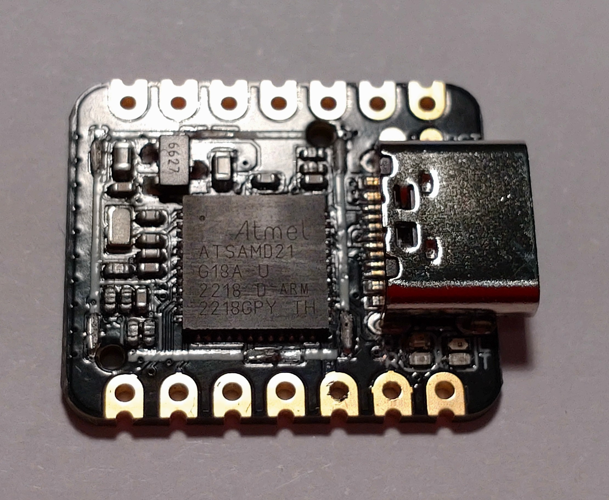

# Low Power Stamp Sized Development Boards

### Table of contents

[1. Motivation](#motivation)  
[2. MCUs](#mcus)  
[3. Low Power Strategies](#low-power-stragegies)  
[4. Seed Studio XIAO SAMD21](#seed-studio-xiao-samd21)  
[5. Seed Studio XIAO ESP32C3](#seed-studio-xiao-esp32c3)  
[6. Conclusions](#conclusions)  
[7. Licenses and Credits](#licenses-and-credits)  

## Motivation

After testing a solar powered energy harvesting module I was looking for a suitable microcontroller development board with the following features:

- variable supply voltage between 2 V and 3 V
- standby consumption less than 5 µA
- power on consumption less than 5 mA
- extended standby durations with periodic wakeup periods of at least 20 minutes
- I2C and SPI support
- read Vcc or 1 analog input
- 9 digital I/Os
- stamp sized, not larger than 25x20 mm
- optional 433 MHz RF transmitter

## MCUs

A brief web search resulted in a comparatively short list of candidates (definitely not representative). The following table lists the lowest possible consumption of the MCUs of these candidates and of a few additional popular MCUs. The values are taken from the manufacturer's datasheet, preferably for 3 V Vcc where available:

| MCU                   | Standby [µA]       | max. Wakeup Period | Notes                       | 
| ----------------------| ------------------ | ------------------ | --------------------------- | 
| Atmel ATtiny          |  10.00 (max)       | 8 s (watchdog)     | small flash, limited SPI    | 
| Atmel ATmega328P      |  44.00 (max)       | 8 s (watchdog)     | no stamp sized boards found | 
| Atmel ATmega32U2/4    |  10.00             | 8 s (watchdog)     |                             | 
| Espressif ESP8266     |  20.00             | 71 min (DSW)       |                             | 
| Espressif ESP32S1     |  10.00 (RTC)       | 4 h (RTC)          |                             | 
| Espressif ESP32C3     |   5.00 (RTC)       | 4 h (RTC)          |                             | 
| Feescale Kinetis KL26 |   1.07 (VLLS1 RTC) | 136 y (RTC)        | no stamp sized boards found | 
| Microchip SAM D21/DA1 |   4.06 (STDBY RTC) | 136 y (RTC)        |                             | 
| NORDIC nRF52832       |   1.90 (RTC)       | 24 d (RTC)         |                             | 
| NORDIC nRF52833       |   1.60 (RTC)       | 24 d (RTC)         |                             | 
| NORDIC nRF52840       |   1.50 (RTC)       | 24 d (RTC)         |                             | 
| Raspberry RP2040      | 180.00 (DORMANT)   | RTC alarm          |                             | 
| ST STM8L              |   0.92 (AH RTC)    | 36 h (RTC)         | no stamp sized boards found | 

While some MCUs include a WiFi and/or Bluetooth transmitter, I could not find a mainstream MCU with a sub 1 GHz transmitter. On the other hand there are several boards available that combine one of the MCUs listed with a separate RF chip. 

The table above should have a column for the power on consumption, but here things become difficult. The various manufacturers don't use standardized benchmarks limiting a comparison based on the datasheet values.

The listed MCUs allow changing the clock speed and disabling various features to save power, but this requires a MCU specific implementation. Making use of these MCU specific options and applying them to the use case will minimize the average power consumption. The result will probably differ significantly form the typical values listed in the datasheet.

Excluding all boards with a standby consumption that is higher than targeted and looking at current price and availability I selected the Seed Studio XIAO ESP32C3 and SAMD21 for closer inspection.

## Low Power Strategies

When designing a microcontroller application that should work with a power supply that is sustained by energy harvesting, the average energy consumption must stay significantly below the average energy yield, typically limiting the complexity of the application. To make the most of the energy available, the following strategies come to mind:

- adjusting the CPU speed to the task complexity
- adjusting the application activity to the available energy
- passive waiting
- entering standby as much as possible
- power optimized circuit design

Which of these strategies can be employed depends on the application. The best results can be achieved if all strategies can be combined.

Reducing the clock speed to a frequency suitable for the use case is typically the simplest way to reduce power consumption because many MCUs show a more or less linear correlation between clock speed and consumption.

The other strategies mentioned require a MCU specific implementation because the power saving features of the MCUs and their use differ significantly.

The code of this project provides an example how to use the features of a specific MCU to this end and it will also show that the programming by itself is not enough to minimize the power consumption to an acceptable level. Note that for the sake of easy current measurement active waiting instead of passive waiting is used by calling *delay()*.


## Seed Studio XIAO SAMD21

### Throttling the CPU

Starting with the Seed Studio XIAO SAM D21 and using the Arduino IDE the "blink" was running in no time, but then frustration set in because it was not possible to change the clock speed to 8 MHz by adding an entry for *F_CPU* to Arduino's boards.txt - the MCU just kept hanging in startup.

Repeating this test with a Teensy LC took only a few minutes - throttling the clock just worked as expected and even USB kept working. The Teensy LC has a Feescale Kinetis KL26 MCU with the same ARM Cortex-M0+ core as the Microchip SAM D21/DA1 MCU. This confirmed to me that the problem with the XIAO SAMD21 was not due to the MCU but probably due to the SDK. 

Looking through the Arduino SAMD SDK source files the cause could be traced to the initialization of the main oscillator in the reset handler *SystemInit()* in file startup.c (from Seed Studio SAMD SDK 1.8.3). The DFLL48M must be initialized for approximately 48 MHz, regardless of the desired main clock speed, but was using *F_CPU* as parameter. Setting *F_CPU* to 32 MHz still worked, but 8 MHz is definitely out of range. The following modification of startup.c allows the selection of several lower clock frequencies (e.g. 24 MHz and 6 MHz). Only USB will no longer work because it needs a GCLK running at 48 MHz.

```C++
* 4) Enable DFLL48M clock
...
/* The DFLL48M clock is specified for 48 MHz, cf product datasheet chapter 37.13.3 - Digital Frequency Locked Loop (DFLL48M) Characteristics. Configuring other frequencies might work, but is not supported. */
    
#if F_CPU >= 32000000L
  #define F_DFLL F_CPU
  #define GCLK0_DIV -1
#elif F_CPU == 24000000L
  #define F_DFLL 48000000L
  #define GCLK0_DIV 0
#elif F_CPU == 16000000L
  #define F_DFLL 32000000L
  #define GCLK0_DIV 0
#elif F_CPU == 12000000L
  #define F_DFLL 48000000L
  #define GCLK0_DIV 1
#elif F_CPU == 8000000L
  #define F_DFLL 32000000L
  #define GCLK0_DIV 1
#elif F_CPU == 6000000L
  #define F_DFLL 48000000L
  #define GCLK0_DIV 2
#elif F_CPU == 4000000L
  #define F_DFLL 32000000L
  #define GCLK0_DIV 2
#elif F_CPU == 3000000L
  #define F_DFLL 48000000L
  #define GCLK0_DIV 3
#elif F_CPU == 1500000L
  #define F_DFLL 48000000L
  #define GCLK0_DIV 4
#else
  #error supported F_CPU values are 1500000L, 3000000L, 6000000L, 12000000L, 24000000L and 48000000L
#endif

SYSCTRL->DFLLMUL.reg = SYSCTRL_DFLLMUL_CSTEP( 31 ) | // Coarse step is 31, half of the max value
                       SYSCTRL_DFLLMUL_FSTEP( 511 ) | // Fine step is 511, half of the max value
                       SYSCTRL_DFLLMUL_MUL( (F_DFLL + VARIANT_MAINOSC/2) / VARIANT_MAINOSC ) ; // External 32KHz is the reference
...
/* ----------------------------------------------------------------------------------------------
 * 5) Switch Generic Clock Generator 0 to DFLL48M. CPU will run at F_CPU.
 */
GCLK->GENDIV.reg = GCLK_GENDIV_ID( GENERIC_CLOCK_GENERATOR_MAIN ) | // Generic Clock Generator 0
                   (GCLK0_DIV >= 0? GCLK_GENDIV_DIV(GCLK0_DIV) : 0);  // Divide by 2^(GCLK0_DIV + 1)
...
/* Write Generic Clock Generator 0 configuration */
GCLK->GENCTRL.reg = GCLK_GENCTRL_ID( GENERIC_CLOCK_GENERATOR_MAIN ) | // Generic Clock Generator 0
                    GCLK_GENCTRL_SRC_DFLL48M | // Selected source is DFLL 48MHz
//                      GCLK_GENCTRL_OE | // Output clock to a pin for tests
                    GCLK_GENCTRL_IDC | // Set 50/50 duty cycle
                    GCLK_GENCTRL_GENEN |
                    (GCLK0_DIV >= 0? GCLK_GENCTRL_DIVSEL : 0);
```

An already patched version of [startup.c](arduino/startup.c "Seed Studio SAMD SDK 1.8.3 startup.c") is included with the project files.

With this blocker removed I was able to run "blink" at 6 MHz, feeding 3.0 V into the 3.3 V pin of the board. USB disconnected, green LED cut off on the cathode side and yellow LED on required 3.17 mA. Turning the yellow LED off let the current drop to 2.09 mA. 

### Standby

Putting the MCU into standby mode left 33 µA. Setting input pullup mode on all pins still left 16 µA, almost 12 µA higher than the value from the datasheet. It tried the EnergySaving class coming with the Seed Studio SAMD SDK to put the MCU into standby mode, but this increased the standby current by another 18 µA, because the library keeps the non volatile memory controller enabled.

Repeating this test with the Teensy LC using the Snooze library the standby current was immediately at 4.3 µA. Another study of the Microchip datasheet and another web search indicated that the high standby current is not due to a misconfiguration of the MCU but may be caused by the board components. Checking the schematic of the XIAO board, a reverse voltage into the voltage regulator U1 comes up as prime candidate. Using a handheld milling cutter I weakened the top edges of the RF shield, opening it with a needle, similar to opening a can. The remaining sides of the RF shield could be removed from the PCB by bending them back and forth a few times. This is what the board looks like without a RF shield:



With a needle it was possible to lift pin 3 of U1 from the PCB with very little force. Now the standby current reads 2.0 µA, even without changing the mode of all pins to input pullup.

### Arduino Framework Limitations

The project code is specifically tailored for the SAMD21. Most of the code is not using the Arduino framework but the CMSIS-Core interface to access the MCU registers directly. Several methods of the project code are variations of methods of the Arduino core SDK, the Arduino library RTCZero and the ArduinoLowPowerClass. Using the Arduino implementations directly will not provide the same results in regard to power saving because the Arduino framework is designed for ease of use. 

### RTC and EIC

Using the Arduino library RTCZero would have been convenient, but only the clock/calendar mode is implemented and XOSC32K is used as clock source. Using OSCULP32K instead should minimize power consumption during standby further at the cost of a little timing precision. Using the RTC counter mode 0 will provide a periodic wakeup from standby. The class RealTimeClock of the project codes wraps the necessary setup tasks.

The standby current with the RTC based on OSCULP32K measured 2.1 µA - this is less than half the value from the datasheet with RTC based on OSC32K. 

Activating EIC additionally the same way does not change this value. This allows both timed and interrupt driven wakeup from standby without a significant change in power consumption.

### SAMD21 Asynchronous Clocks

As the SAMD21 can be configured to use asynchronous clocks with different speeds for the CPU and the peripheral functions, almost every data exchange between the CPU and a peripheral must be synchronized, requiring extra code. This becomes apparent if you look at the method *RealTimeClock::enable()* in the project code, where around 40 % of the operations are sync waits. In such an environment the effectiveness of the code execution significantly depends on how much the clock speeds differ and how often peripheral access is used.

The Arduino core initializes all bus clock dividers at the end of *SystemInit()* to 1 to improve performance in this regard. This results in an almost classic MCU behaviour, where CPU and important peripherals use the same clock. 

Additionally the NVM read wait states can be set to zero when throttling the MCU main clock. This is done by the method *System::tune()* in the project code.

### Power On

The standby power consumption of the modified XIAO SAMD21 is comparatively low at 2.1 µA with only RTC and EIC still enabled and running on OSCULP32K. When the MCU is active the power consumption of the board increases by a factor of 1000 to 2.1 mA with:

- main clock running at 6 MHz, based on XOSC32k + DFLL48M
- unnecessary peripheral clocks disabled
- USB disconnected

Tests with the same configuration at different clock frequencies show the following relation between clock frequency and supply current:

$210 µA/MHz + 830 µA$

While the frequency dependent part is comparatively low, the static part is rather high. This is caused by the main clock configuration based on the combination of XOSC32k and DFLL48M. Unsurprisingly the supply current increases only marginally to 2.2 mA at 8 MHz when using OSC8M instead of XOSC32K and DFLL48M showing the following relation between clock frequency and supply current, that is significantly better for lower frequencies:

$240 µA/MHz + 220 µA$

The measured board supply current of 11 mA at the default main clock frequency of 48 MHz of the MCU is significantly more than one expects when looking at the SAMD21 datasheet, which list only 3.4 mA for a *while(1)* loop, which differs only slightly from the *delay()* call used in the project. The difference results from the test conditions, see datasheet chapter 37.7 - "Power Consumption" for details. Due to the code and hardware optimizations of this projects the 11 mA are still ~2 mA less than other users report for the XIAO SAMD21 running "blink".

More configurations and the measured consumptions are listed at the beginning of the project code.

### Passive Waiting

Some peripheral operations need several clock cycles to complete, e.g. the ADC. Waiting for the result to become available is not effective. If maximum effectiveness is required, consider using an event driven approach. e.g. using interrupts or DMA where applicable. This concept is used in the project code for the RTC timer. The *RTC_Handler()* interrupt service routine will make the LED blink periodically while the MCU is in standby most of the time.

## Seed Studio XIAO ESP32C3

pending ...

## Conclusions

Low power optimization of an MCU is not possible without a thorough understanding of the individual MCU features. There is no simple switch to be flipped to just make it work, instead an use case specific implementation should be considered. A solution can be based on

- an existing framework (e.g. the Arduino framework) and a readily available microcontroller board
- MCU register access and an individual PCB

Best results typically require using MCU register access because frameworks are more focused on ease of use and MCU abstraction.

This projects shows that a slightly modified XIAO SAMD21 board combined with a slightly modified Arduino framework and some extra code can be a good choice for a low power project where the active time is short in comparison to the standby time. The resulting power consumption does not differ significantly from a more individual solution. It will allow running on a battery for a year or more, or indefinitely through energy harvesting whenever enough energy has been collected. At the same time the project can still make use of a lot of Arduino libraries without the need to reinvent the wheel.

## Licenses and Credits

### Documentation and Photos

Copyright (c) 2023 [Jens B.](https://github.com/jnsbyr)

[](https://creativecommons.org/licenses/by-nc-sa/4.0/)

### Source Code

Copyright (c) 2023 [Jens B.](https://github.com/jnsbyr)

[](https://opensource.org/licenses/Apache-2.0)

The source code was edited and build using the [Arduino IDE](https://www.arduino.cc/en/software/), [Arduino CLI](https://github.com/arduino/arduino-cli) and [Microsoft Visual Studio Code](https://code.visualstudio.com).

The source code depends on:

#### Arduino SDK & Seed Studio SDK for SAMD21 and SAMD51

Copyright (C) 2014 [Arduino LLC](https://github.com/arduino/Arduino)

[](https://www.gnu.org/licenses/lgpl-2.1)

#### CMSIS Atmel

Copyright (C) 2015 [Atmel Corporation](https://github.com/arduino/ArduinoModule-CMSIS-Atmel)

[](https://opensource.org/licenses/BSD-2-Clause)

Also many thanks to the Open Source community, the bloggers and the forum users that have shared their experience with the SAM D21 MCU.